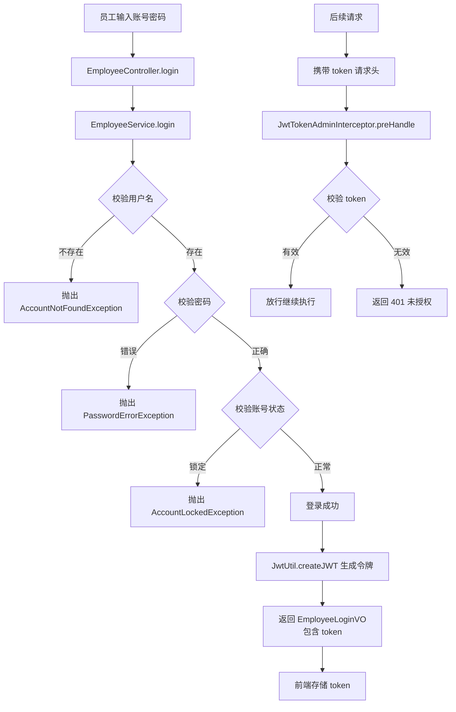
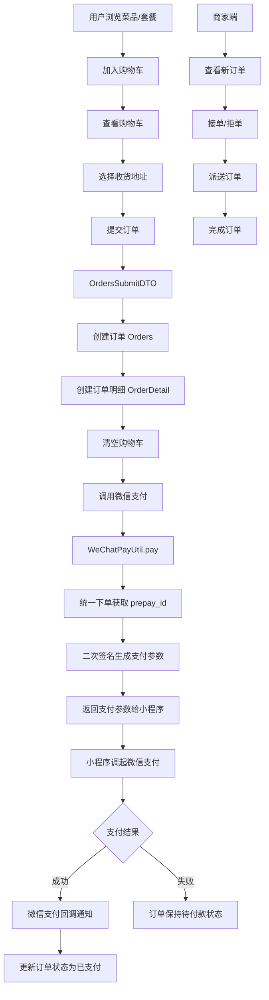
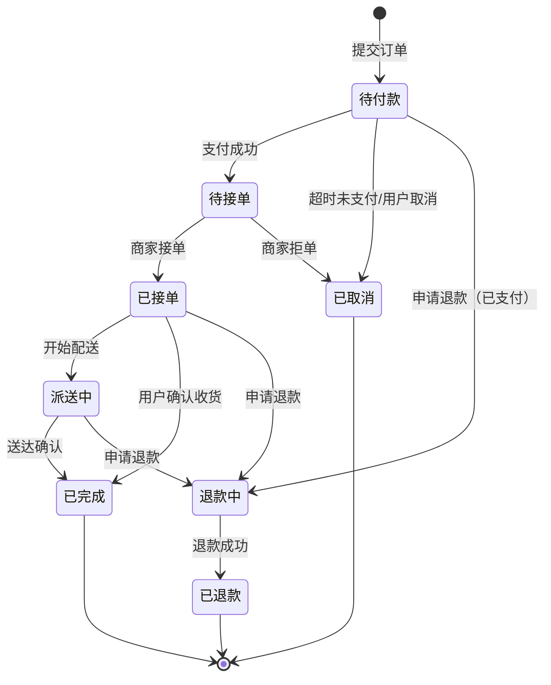
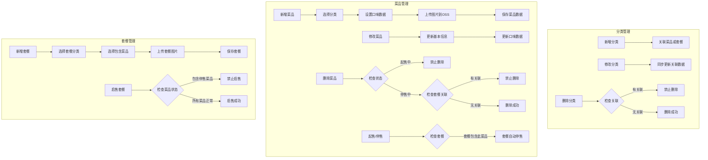
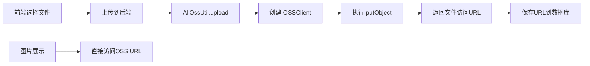

# 甜慕烘焙项目分析文档

## 一、项目概述

**甜慕烘焙**是一个基于 Spring Boot 开发的烘焙/外卖订餐系统，
采用前后端分离架构。项目支持管理端（员工使用）和用户端（微信小程序）双端操作，实现了完整的在线订餐业务流程。

---

## 二、项目整体架构

### 2.1 模块划分

项目采用 Maven 多模块架构，分为三个核心模块：

```
cake-take-out (父项目)
├── cake-common      # 公共模块 - 存放工具类、常量、异常等
├── cake-pojo        # 实体模块 - 存放实体类、DTO、VO
└── cake-server      # 服务模块 - 存放业务逻辑、控制器、配置
```

### 2.2 模块职责说明

| 模块 | 职责 | 主要包结构 |
|------|------|-----------|
| **cake-common** | 提供项目公共组件 | constant、exception、utils、properties、result、context |
| **cake-pojo** | 定义数据模型 | entity、dto、vo |
| **cake-server** | 核心业务实现 | controller、service、mapper、config、interceptor、handler |

---

## 三、技术栈分析

### 3.1 核心技术框架

| 技术 | 版本 | 用途 |
|------|------|------|
| **Spring Boot** | 2.7.3 | 核心应用框架 |
| **Spring MVC** | 2.7.3 | Web 层框架 |
| **MyBatis** | 2.2.0 | ORM 持久层框架 |
| **MySQL** | 8.x | 关系型数据库 |
| **Druid** | 1.2.1 | 数据库连接池 |

### 3.2 辅助技术组件

| 技术 | 版本 | 用途 |
|------|------|------|
| **JWT (jjwt)** | 0.9.1 | 用户身份认证令牌 |
| **Redis** | - | 缓存、会话存储 |
| **Spring Cache** | - | 方法级缓存 |
| **WebSocket** | - | 实时消息推送 |
| **Knife4j** | 3.0.2 | API 接口文档（Swagger增强） |
| **Lombok** | 1.18.20 | 代码简化工具 |
| **Fastjson** | 1.2.76 | JSON 序列化 |
| **PageHelper** | 1.3.0 | 分页插件 |
| **AspectJ** | 1.9.4 | AOP 面向切面编程 |
| **Apache POI** | 3.16 | Excel 报表导出 |

### 3.3 第三方服务集成

| 服务 | SDK/工具 | 用途 |
|------|----------|------|
| **阿里云 OSS** | aliyun-sdk-oss 3.10.2 | 文件/图片存储 |
| **微信支付** | wechatpay-apache-httpclient 0.4.8 | 在线支付、退款 |

---

## 四、业务功能模块

### 4.1 功能模块总览

```
┌─────────────────────────────────────────────────────────────┐
│                      甜慕烘焙系统                            │
├──────────────────────────┬──────────────────────────────────┤
│      管理端 (Admin)       │         用户端 (User)             │
├──────────────────────────┼──────────────────────────────────┤
│  1. 员工管理               │  1. 微信登录                      │
│  2. 分类管理               │  2. 菜品/套餐浏览                  │
│  3. 菜品管理               │  3. 购物车管理                     │
│  4. 套餐管理               │  4. 地址簿管理                     │
│  5. 订单管理               │  5. 订单提交与支付                  │
│  6. 数据统计/报表          │  6. 订单查询                       │
└──────────────────────────┴──────────────────────────────────┘
```

### 4.2 核心实体关系

```
┌─────────────┐     ┌─────────────┐     ┌─────────────┐
│  Category   │────<│    Dish     │>────│ DishFlavor  │
│  (分类)      │     │   (菜品)     │     │  (口味)      │
└─────────────┘     └──────┬──────┘     └─────────────┘
       │                   │
       │            ┌──────┴──────┐
       │            │             │
       └───────────>│  Setmeal    │<────────────┐
                    │  (套餐)      │             │
                    └──────┬──────┘             │
                           │                    │
                    ┌──────┴──────┐             │
                    │ SetmealDish │             │
                    │ (套餐菜品关系)│             │
                    └─────────────┘             │
                                                │
┌─────────────┐     ┌─────────────┐     ┌──────┴──────┐
│    User     │<───>│   Orders    │<───>│ OrderDetail │
│  (用户)      │     │   (订单)     │     │  (订单明细)  │
└──────┬──────┘     └─────────────┘     └─────────────┘
       │
       │            ┌─────────────┐
       └───────────>│ShoppingCart │
                    │  (购物车)    │
                    └─────────────┘
       │
       └───────────>│AddressBook  │
                    │  (地址簿)    │
                    └─────────────┘
```

### 4.3 实体类详细说明

| 实体类 | 说明 | 核心字段 |
|--------|------|----------|
| **Employee** | 员工/管理员 | username, password, name, phone, status |
| **User** | 微信小程序用户 | openid, name, phone, avatar |
| **Category** | 菜品/套餐分类 | type(1菜品/2套餐), name, sort, status |
| **Dish** | 菜品信息 | name, categoryId, price, image, status |
| **DishFlavor** | 菜品口味选项 | dishId, name, value |
| **Setmeal** | 套餐信息 | name, categoryId, price, status |
| **SetmealDish** | 套餐与菜品关联 | setmealId, dishId, copies(份数) |
| **Orders** | 订单主表 | number, status, amount, payStatus, address |
| **OrderDetail** | 订单明细 | orderId, dishId/setmealId, number, amount |
| **ShoppingCart** | 购物车 | userId, dishId/setmealId, number |
| **AddressBook** | 用户地址簿 | userId, consignee, phone, address, isDefault |

---

## 五、复杂业务流程

### 5.1 员工登录认证流程



### 5.2 用户下单支付流程



### 5.3 订单状态流转



### 5.4 菜品/套餐管理流程



### 5.5 文件上传流程（阿里云OSS）



---

## 六、核心代码分析

### 6.1 统一响应结果封装

```java
// Result.java - 后端统一返回结果
@Data
public class Result<T> implements Serializable {
    private Integer code; // 编码：1成功，0和其它数字为失败
    private String msg;   // 错误信息
    private T data;       // 数据

    public static <T> Result<T> success() { ... }
    public static <T> Result<T> success(T object) { ... }
    public static <T> Result<T> error(String msg) { ... }
}
```

### 6.2 JWT 认证实现

```java
// JwtUtil.java - JWT 工具类
public class JwtUtil {
    // 生成 JWT 令牌
    public static String createJWT(String secretKey, long ttlMillis, Map<String, Object> claims) {
        JwtBuilder builder = Jwts.builder()
            .setClaims(claims)
            .signWith(SignatureAlgorithm.HS256, secretKey.getBytes(StandardCharsets.UTF_8))
            .setExpiration(new Date(System.currentTimeMillis() + ttlMillis));
        return builder.compact();
    }

    // 解析 JWT 令牌
    public static Claims parseJWT(String secretKey, String token) {
        return Jwts.parser()
            .setSigningKey(secretKey.getBytes(StandardCharsets.UTF_8))
            .parseClaimsJws(token).getBody();
    }
}
```

### 6.3 全局异常处理

```java
// GlobalExceptionHandler.java - 全局异常处理器
@RestControllerAdvice
@Slf4j
public class GlobalExceptionHandler {
    @ExceptionHandler
    public Result exceptionHandler(BaseException ex) {
        log.error("异常信息：{}", ex.getMessage());
        return Result.error(ex.getMessage());
    }
}
```

### 6.4 ThreadLocal 上下文

```java
// BaseContext.java - 基于 ThreadLocal 的上下文
public class BaseContext {
    public static ThreadLocal<Long> threadLocal = new ThreadLocal<>();
    
    public static void setCurrentId(Long id) { threadLocal.set(id); }
    public static Long getCurrentId() { return threadLocal.get(); }
    public static void removeCurrentId() { threadLocal.remove(); }
}
```

---

## 七、项目配置说明

### 7.1 应用配置 (application.yml)

```yaml
server:
  port: 8080

spring:
  profiles:
    active: dev
  datasource:
    druid:
      driver-class-name: com.mysql.cj.jdbc.Driver
      url: jdbc:mysql://localhost:3306/cake_take_out?...
      username: root
      password: root

mybatis:
  mapper-locations: classpath:mapper/*.xml
  type-aliases-package: com.cake.entity
  configuration:
    map-underscore-to-camel-case: true

cake:
  jwt:
    admin-secret-key: itcast
    admin-ttl: 7200000  # 2小时
    admin-token-name: token
```

### 7.2 配置属性类

| 配置类 | 前缀 | 说明 |
|--------|------|------|
| JwtProperties | cake.jwt | JWT 令牌配置 |
| WeChatProperties | cake.wechat | 微信支付/小程序配置 |
| AliOssProperties | cake.alioss | 阿里云 OSS 配置 |

---

## 八、安全设计

### 8.1 认证机制
- **管理端**：JWT Token 认证
- **用户端**：JWT Token 认证（基于微信 OpenID）

### 8.2 密码安全
- 密码使用 MD5 加密存储
- 登录时比对加密后的密码

### 8.3 接口安全
- 管理端接口统一添加 `/admin` 前缀
- JwtTokenAdminInterceptor 拦截器校验 Token
- 登录接口排除校验

---

## 九、扩展功能预留

根据代码分析，项目还预留了以下功能的扩展空间：

1. **数据统计报表**：已定义相关 VO 类（BusinessDataVO、OrderReportVO 等）
2. **Redis 缓存**：已引入 spring-boot-starter-data-redis
3. **Spring Cache**：已引入 spring-boot-starter-cache
4. **WebSocket**：已引入 spring-boot-starter-websocket（用于实时消息推送）
5. **Excel 导出**：已引入 Apache POI

---

## 十、总结

甜慕烘焙项目是一个结构清晰、分层明确的 Spring Boot 企业级应用，具有以下特点：

1. **架构规范**：采用 Maven 多模块、分层架构（Controller-Service-Mapper）
2. **技术先进**：集成主流技术栈（Spring Boot、MyBatis、JWT、Redis 等）
3. **功能完整**：覆盖完整的订餐业务流程（浏览→购物车→下单→支付→配送）
4. **扩展性强**：预留了缓存、消息推送、报表等扩展功能
5. **安全性高**：JWT 认证、密码加密、全局异常处理

该项目适合作为 Java Web 开发的参考案例，涵盖了企业级应用开发的常见场景和最佳实践。
